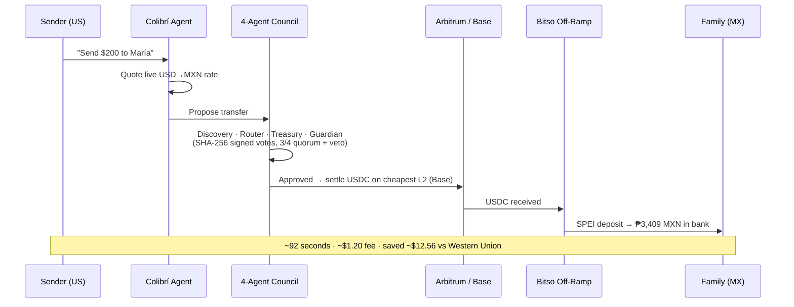
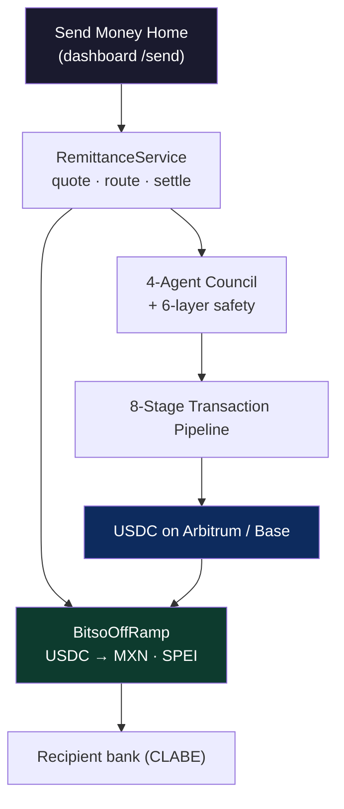

<div align="center">

# 🐦 Colibrí

### Send money home. Your AI agent finds the cheapest route and settles in seconds.

**Colibrí is an AI remittance agent for Latin America. Type a dollar amount, pick a family member, and a 4-agent council settles USDC on an Ethereum L2 and off-ramps it to Mexican pesos via Bitso — ~90 seconds, ~$1 fee, a fraction of Western Union.**

[](#-tests--what-is-real)
[](#-built-on-ethereum-l2s)
[](#-how-it-works)
[](./LICENSE)

Built for **[Ethereum México 2026](https://dorahacks.io/hackathon/ethmexico2026bitso/detail)** · w/ Bitso

</div>

---

## The Problem

Every year, **~$65 billion** flows from workers in the US to families in Mexico — the largest remittance corridor on earth. Sending it still feels like 1990:

- **Fees eat ~6%.** Western Union charges a flat fee *plus* a 2–3% hidden FX markup. On a $200 transfer, the family loses ~$13.
- **It's slow.** Bank deposits take 1–3 days. A medical bill or a school fee doesn't wait.
- **It's opaque.** Nobody tells you the real exchange rate, the real fee, or where the money is.

Stablecoins on cheap L2s already solve the *rails*. What's missing is an **agent that drives them** — that quotes the live rate, finds the cheapest chain, checks the recipient, and turns USDC into pesos in the recipient's bank account, without the sender thinking about crypto at all.

## The Solution

**Colibrí treats a remittance as a decision, not a transfer.** You enter `$200` and pick *María, Guadalajara*. From there the agent takes over:

1. **Quote** — pulls a live USD→MXN rate and prices the whole transfer (network + off-ramp), up front.
2. **Council** — four specialized agents reason and vote (3/4 quorum, Guardian holds veto, every vote SHA-256 signed).
3. **Route** — compares **Arbitrum vs Base** and picks the cheapest L2 with USDC liquidity.
4. **Settle** — moves USDC through an 8-stage transaction pipeline (`VALIDATE → … → RECORD`).
5. **Off-ramp** — **Bitso** converts USDC → MXN and drops a **SPEI deposit** into the recipient's bank (CLABE).

Result: **₱3,409 MXN delivered to María in ~92 seconds for ~$1.20** — she keeps **~$12.56 more** than she would through Western Union.

> **This is not a crypto wallet. It's an autonomous agent for the world's biggest remittance corridor.**

---

## 🔁 How It Works



### Why an AI council instead of a button

An agent that moves a family's money must be **safer than a human and cheaper than a bank**. Four agents must agree before a single peso moves:

| Agent | Role | Veto |
|-------|------|------|
| **Discovery** | Verifies the recipient — KYC on file, prior transfer history, risk score | No |
| **Router** | Compares Arbitrum & Base, picks the cheapest L2 + amount | No |
| **Treasury** | Confirms USDC liquidity and wallet health before committing | No |
| **Guardian** | Fraud, limit, and anomaly checks — **solo veto** at high confidence | **Yes** |

Behind them sits a **6-layer safety stack** (policy engine, mood-based limits, anomaly detection, risk engine, guardian veto, and an immutable "danger can only escalate" rule) and an **8-stage pipeline** where every transfer is validated, quoted, approved, signed, broadcast, confirmed, verified on-chain, and recorded to a tamper-proof event log.

---

## 💸 The Money Math

A $200 transfer to Mexico, priced live in the app:

| Rail | Fee | FX markup | Speed | Family receives |
|------|-----|-----------|-------|-----------------|
| **Colibrí** | **~$1.20** | none (mid-market) | **~90 sec** | **₱3,409** |
| Western Union | ~$9.00 | ~2.5% | 1–3 days | ₱3,194 |
| Bank wire (SWIFT) | ~$30 | ~3% | 2–5 days | ₱2,828 |

*Rates illustrative; the agent fetches a live FX + gas quote at send time. The savings scale with every transfer — at corridor volume, the difference is billions.*

---

## ⛓ Built on Ethereum L2s

Colibrí settles in **USDC on Arbitrum One and Base** — the cheap, fast, EVM L2s where stablecoin remittances actually make sense.

- **Router agent** compares live fees across L2s and routes to the cheapest (Base ≈ $0.01 vs Arbitrum ≈ $0.04 vs Ethereum L1 ≈ $3.20).
- **Native USDC** on both chains ([`USDC_CONTRACTS`](./agent/src/services/wallet-chains.ts)).
- **Account abstraction (ERC-4337)** support so the sender never touches gas.

| Chain | Role | Asset |
|-------|------|-------|
| **Base** | Primary settlement (cheapest) | USDC |
| **Arbitrum One** | Alternate L2 route | USDC |
| Bitso | Fiat off-ramp → MXN via SPEI | MXN |

---

## 🏗 Architecture

Colibrí's payment **engine** — multi-agent consensus, the 8-stage pipeline, the safety stack — is a mature, battle-tested codebase (**1,183 passing tests**). The **remittance product** on top of it — the USD→MXN quoting, the Bitso off-ramp, the Arbitrum/Base routing, and the entire *Send Money Home* experience — was built for Ethereum México 2026.



Key new code for this hackathon:
- [`agent/src/services/remittance.service.ts`](./agent/src/services/remittance.service.ts) — USD→MXN quoting, route selection, the `BitsoOffRamp` adapter, and settlement.
- [`agent/src/routes/remittance.routes.ts`](./agent/src/routes/remittance.routes.ts) — `GET /api/remittance/quote`, `GET /api/remittance/contacts`, `POST /api/remittance/send`.
- [`dashboard/src/pages/SendMoney.tsx`](./dashboard/src/pages/SendMoney.tsx) — the live demo flow.
- Base + native-USDC wired into the chain layer ([`chain-abstraction.ts`](./agent/src/chains/chain-abstraction.ts), [`wallet-chains.ts`](./agent/src/services/wallet-chains.ts)).

---

## ✅ Tests & What Is Real

Honesty matters when money is involved:

- ✅ **The agent, council, pipeline, and safety stack are real and tested** — 1,183 passing tests (`cd agent && npm test`).
- ✅ **The on-chain USDC leg runs through the same production pipeline** that has executed verified mainnet stablecoin transfers.
- ✅ **L2 routing across Arbitrum & Base is real** — live fee comparison picks the cheapest chain.
- 🧪 **The Bitso MXN off-ramp ships in `sandbox` mode** — it computes the exact SPEI deposit and reference deterministically. Set `BITSO_API_KEY` to switch [`BitsoOffRamp`](./agent/src/services/remittance.service.ts) to live conversion + SPEI withdrawal.

---

## 🚀 Quick Start

```bash
# 1. Install (agent + dashboard)
npm install

# 2. Run the dashboard + agent together
npm run dev          # dashboard → http://localhost:8080   ·   agent API → http://localhost:3001

# 3. Open the demo
open http://localhost:8080/send
```

Try the API directly:

```bash
curl "http://localhost:3001/api/remittance/quote?usd=200&deliverAs=mxn"
```

> The dashboard ships with realistic demo data and runs **standalone** — even without the backend, `/send` plays the full USD→MXN flow end-to-end. Perfect for a live demo.

---

## 🎬 The Demo (`/send`)

1. Enter **$200**, pick **María (Guadalajara)**.
2. Hit **Send with Colibrí**.
3. Watch the **4-agent council** reason and vote, the **8-stage pipeline** tick green, and the **result card** land: *₱3,409 MXN delivered · 92 seconds · saved $12.56 vs Western Union*.

Full shot list + voiceover in [`DEMO_SCRIPT.md`](./DEMO_SCRIPT.md).

---

## 📊 How Colibrí Maps to the Judging Criteria

| Criterion | Weight | How Colibrí delivers |
|-----------|:------:|----------------------|
| **Technical quality & code** | 30% | 1,183 passing tests · multi-agent consensus · 8-stage pipeline · 6-layer safety · TypeScript strict · 0 type errors |
| **Innovation & originality** | 25% | An *AI council* that reasons about route, recipient, and fraud before sending a remittance — not a payment button |
| **Real-world impact (LATAM)** | 20% | Directly attacks the $65B US→Mexico corridor; saves a real family ~$13 per $200 and 1–3 days, every transfer |
| **Use of Ethereum / L2 stack** | 15% | Settles USDC on **Arbitrum + Base**, live cheapest-L2 routing, ERC-4337 gasless support |
| **Presentation & demo** | 10% | Polished one-click `/send` experience, live agent reasoning, savings table, 2-min scripted demo |

---

## 🔧 Tech Stack

| Layer | Technology |
|-------|-----------|
| Agent | Node.js 22, TypeScript 5.9 (strict), 4-agent consensus, ReAct reasoning, LLM cascade (Groq → Gemini → rule-based) |
| Settlement | USDC on Arbitrum & Base · 8-stage pipeline · ERC-4337 account abstraction |
| Off-ramp | Bitso (USDC → MXN via SPEI) |
| Frontend | React 19, Vite, Tailwind CSS 4 |
| API | Express 5, Socket.IO, Swagger/OpenAPI |
| Quality | 1,183 tests · Winston logging · Prometheus metrics |

---

<div align="center">

**Apache 2.0** · Built for **Ethereum México 2026** w/ Bitso

*Send money home — the way it should work.*

</div>
