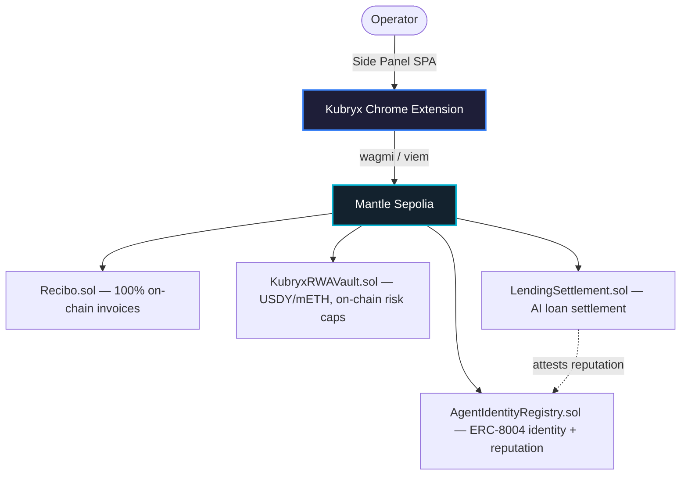

# Kubryx OS

**The Turing Test Hackathon 2026 (Mantle Network) — AI × RWA Submission**

An AI × RWA financial operating system where **ERC-8004-identified AI agents negotiate, rebalance, and settle real-world-asset positions (USDY / mETH) on Mantle — verifiably on-chain.** Delivered as a zero-redirection Chrome Extension Single Page Application (SPA) with eight tools: 100% on-chain invoicing, AI-negotiated lending, RWA treasury automation, private trading, split payments, credit, agents, and a unified dashboard.

---

## Why this fits the AI × RWA track

| Track question | Kubryx answer |
|---|---|
| **What real-world asset are you bringing on-chain?** | Tokenized RWAs modeled on Ondo **USDY** (stable yield) and **mETH** (ETH-staking yield) — Mantle's flagship RWA assets. |
| **How does AI play a role?** | An AI agent proposes treasury allocations and negotiates loan terms. The *decision* is AI; the *enforcement* is Solidity. |
| **How is it realized on Mantle?** | Every agent decision is written and guarded on-chain: `KubryxRWAVault.rebalance()` enforces risk caps, `LendingSettlement.settleLoan()` records negotiated terms, and each agent owns an **ERC-8004 identity NFT** whose reputation is updated only by attested on-chain outcomes. |

---

## On-Chain Architecture (Mantle Sepolia · chain 5003)



### Smart contracts (`invoices/contracts/`)
| Contract | Role | AI-on-chain function |
|---|---|---|
| `AgentIdentityRegistry.sol` | **ERC-8004** soulbound identity NFT for each agent; reputation written only by authorized attestors; fully on-chain base64 metadata | `registerAgent`, `recordJob` |
| `LendingSettlement.sol` | Settles AI-negotiated loans on-chain (rate/principal/collateral envelope), credits the agent's reputation | `settleLoan` (agent-triggered) |
| `KubryxRWAVault.sol` | USDY/mETH RWA vault; **risk guardrails enforced in Solidity** (mETH ≤ 70%, allocation must sum to 100%) | `rebalance` (AI proposes, chain enforces) |
| `MockRWAToken.sol` | Testnet USDY/mETH mocks with on-chain yield-rate metadata | `currentYield` |
| `Recibo.sol` | 100% on-chain invoice registry — metadata + payment status stored as structs | `createInvoice`, `payInvoice` |

> **No off-chain database.** Invoice metadata, vault allocations, loan envelopes, and agent reputation all live in contract state. Agent-identity NFT metadata is rendered fully on-chain as a base64 data URI (no IPFS).

---

## Deploy to Mantle Sepolia

```bash
cd invoices
npm install
# .env.local: DEPLOYER_PRIVATE_KEY=0x...   (fund with Mantle Sepolia MNT)
#             MANTLESCAN_API_KEY=...        (for verification)

# Deploys RWA tokens + vault + ERC-8004 registry + lending settlement,
# registers the Lendora agent, and writes addresses to hub/lib/rwa-deployed.json
npx hardhat run contracts/scripts/deploy-rwa.ts --config contracts/hardhat.config.ts --network mantleSepolia
```

The script prints `npx hardhat verify ...` commands for each contract. Run them to verify on the Mantle Explorer (required for the 20 Project Deployment Award).

### Deployed Addresses (Mantle Sepolia)
<!-- Fill in after running deploy-rwa.ts — these are read live from hub/lib/rwa-deployed.json -->
| Contract | Address |
|---|---|
| AgentIdentityRegistry (ERC-8004) | `TBD` |
| LendingSettlement | `TBD` |
| KubryxRWAVault | `TBD` |
| kUSDY / kMETH | `TBD` / `TBD` |
| Recibo | `TBD` |

---

## Run the hub locally

```bash
cd hub
npm install
npm run dev        # Next.js on http://localhost:3000
```

### Install as a Chrome Extension (Side Panel SPA)
1. `chrome://extensions/` → enable **Developer mode**
2. **Load unpacked** → select `chrome-extension/`
3. Click the Kubryx icon to open the Side Panel.

---

## Tech Stack
- **Frontend:** Next.js 16, TypeScript, Tailwind v4
- **Extension:** Chrome Side Panel API, hash routing
- **Contracts:** Solidity 0.8.20, Hardhat 3, OpenZeppelin; self-contained ERC-8004 registry
- **Web3:** wagmi, viem, RainbowKit — Mantle Sepolia (5003)
- **AI:** Groq LLaMA-3.3-70B-Versatile (loan negotiation, invoice parsing, treasury advice)

---

## Demo video walkthrough (≥ 2 min) — suggested script
1. Open the Side Panel; show the dashboard live on Mantle Sepolia.
2. **Invoicing:** paste an invoice → AI parses it → create on-chain → pay → show the tx on Mantle Explorer.
3. **Lendora:** chat to negotiate a loan → agent calls `settleLoan` → show the loan written on-chain.
4. **Treasury:** AI proposes a USDY/mETH allocation → `rebalance` → show an over-risk proposal **reverting** on-chain (the guardrail).
5. **ERC-8004:** open the agent's identity NFT on the Explorer; show reputation incremented by the settled loan.

---

## What's not in scope
Earlier standalone prototypes live in [`legacy-prototypes/`](legacy-prototypes/) and are **excluded** from this submission. The submission is the `hub/` app + `invoices/contracts/`.

---

## License & Attribution
Independently designed and built by **vsrupeshkumar**. Apache License 2.0.
